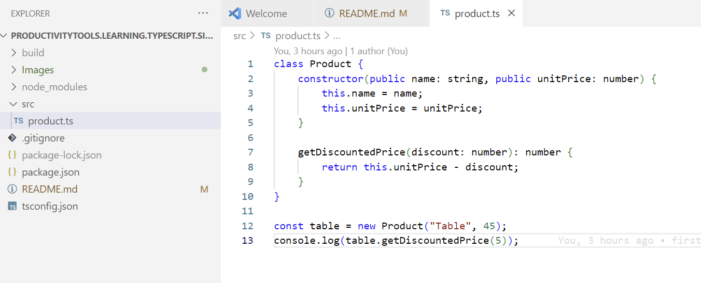

<!--Category:GAS--> 
 

    <a href="http://productivitytools.tech/"><a> 
    

    

# Learning - TypeScript - Simple class

I am learning typescript and this is basic project with one packet reference and build defined
<!--more-->

